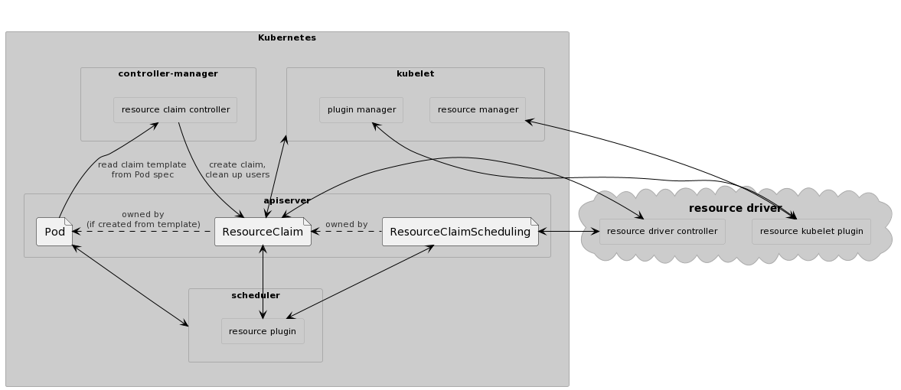
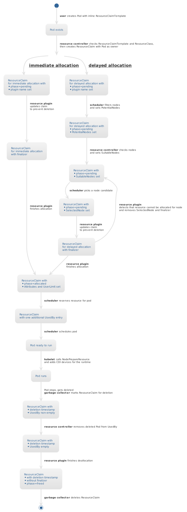
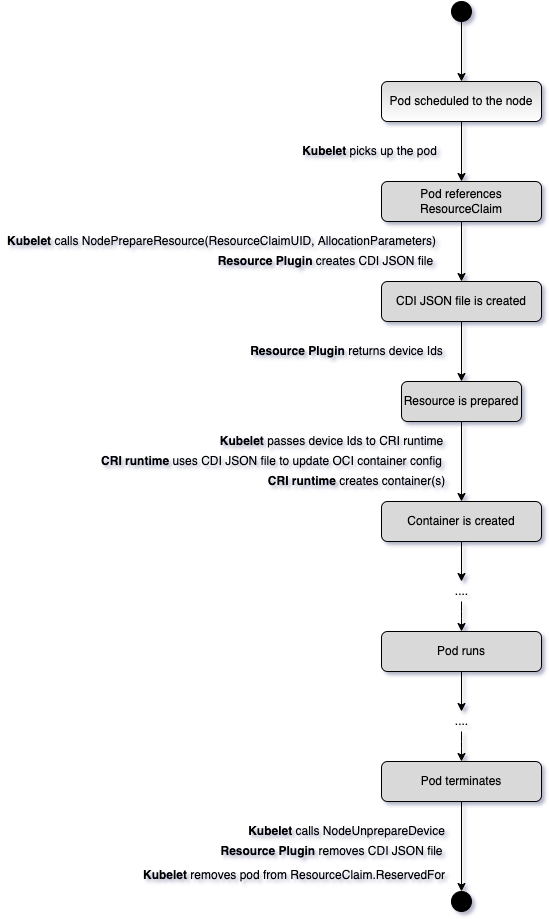

<!--
**Note:** When your KEP is complete, all of these comment blocks should be removed.

To get started with this template:

- [ ] **Pick a hosting SIG.**
  Make sure that the problem space is something the SIG is interested in taking
  up. KEPs should not be checked in without a sponsoring SIG.

- [ ] **Create an issue in kubernetes/enhancements**
  When filing an enhancement tracking issue, please make sure to complete all
  fields in that template. One of the fields asks for a link to the KEP. You
  can leave that blank until this KEP is filed, and then go back to the
  enhancement and add the link.

- [ ] **Make a copy of this template directory.**
  Copy this template into the owning SIG's directory and name it
  `NNNN-short-descriptive-title`, where `NNNN` is the issue number (with no
  leading-zero padding) assigned to your enhancement above.

- [ ] **Fill out as much of the kep.yaml file as you can.**
  At minimum, you should fill in the "Title", "Authors", "Owning-sig",
  "Status", and date-related fields.

- [ ] **Fill out this file as best you can.**
  At minimum, you should fill in the "Summary" and "Motivation" sections.
  These should be easy if you've preflighted the idea of the KEP with the
  appropriate SIG(s).

- [ ] **Create a PR for this KEP.**
  Assign it to people in the SIG who are sponsoring this process.

- [ ] **Merge early and iterate.**
  Avoid getting hung up on specific details and instead aim to get the goals of
  the KEP clarified and merged quickly. The best way to do this is to just
  start with the high-level sections and fill out details incrementally in
  subsequent PRs.

Just because a KEP is merged does not mean it is complete or approved. Any KEP
marked as `provisional` is a working document and subject to change. You can
denote sections that are under active debate as follows:

```
<<[UNRESOLVED optional short context or usernames ]>>
Stuff that is being argued.
<<[/UNRESOLVED]>>
```

When editing KEPS, aim for tightly-scoped, single-topic PRs to keep discussions
focused. If you disagree with what is already in a document, open a new PR
with suggested changes.

One KEP corresponds to one "feature" or "enhancement" for its whole lifecycle.
You do not need a new KEP to move from beta to GA, for example. If
new details emerge that belong in the KEP, edit the KEP. Once a feature has become
"implemented", major changes should get new KEPs.

The canonical place for the latest set of instructions (and the likely source
of this file) is [here](/keps/NNNN-kep-template/README.md).

**Note:** Any PRs to move a KEP to `implementable`, or significant changes once
it is marked `implementable`, must be approved by each of the KEP approvers.
If none of those approvers are still appropriate, then changes to that list
should be approved by the remaining approvers and/or the owning SIG (or
SIG Architecture for cross-cutting KEPs).
-->
# [KEP-3063](https://github.com/kubernetes/enhancements/issues/3063): Dynamic resource allocation


<!-- toc -->
- [Release Signoff Checklist](#release-signoff-checklist)
- [Summary](#summary)
- [Motivation](#motivation)
  - [Goals](#goals)
  - [Non-Goals](#non-goals)
- [Proposal](#proposal)
  - [User Stories](#user-stories)
    - [Cluster add-on development](#cluster-add-on-development)
    - [Cluster configuration](#cluster-configuration)
    - [Partial GPU allocation](#partial-gpu-allocation)
    - [Combined setup of different hardware functions](#combined-setup-of-different-hardware-functions)
  - [Notes/Constraints/Caveats (Optional)](#notesconstraintscaveats-optional)
  - [Risks and Mitigations](#risks-and-mitigations)
- [Design Details](#design-details)
  - [Implementation](#implementation)
  - [Resource allocation flow](#resource-allocation-flow)
  - [API](#api)
  - [kube-controller-manager](#kube-controller-manager)
  - [kube-scheduler](#kube-scheduler)
    - [Pre-filter](#pre-filter)
    - [Filter](#filter)
    - [Post-filter](#post-filter)
    - [Pre-score](#pre-score)
    - [Reserve](#reserve)
    - [Unreserve](#unreserve)
  - [Cluster Autoscaler](#cluster-autoscaler)
  - [kubelet](#kubelet)
    - [Managing resources](#managing-resources)
    - [Communication between kubelet and resource kubelet plugin](#communication-between-kubelet-and-resource-kubelet-plugin)
      - [<code>NodePrepareResource</code>](#)
      - [<code>NodeUnprepareResource</code>](#-1)
    - [Implementing optional resources](#implementing-optional-resources)
    - [Implementing a plugin for node resources](#implementing-a-plugin-for-node-resources)
  - [Test Plan](#test-plan)
      - [Prerequisite testing updates](#prerequisite-testing-updates)
      - [Unit tests](#unit-tests)
      - [Integration tests](#integration-tests)
      - [e2e tests](#e2e-tests)
  - [Graduation Criteria](#graduation-criteria)
    - [Alpha -&gt; Beta Graduation](#alpha---beta-graduation)
    - [Beta -&gt; GA Graduation](#beta---ga-graduation)
  - [Upgrade / Downgrade Strategy](#upgrade--downgrade-strategy)
  - [Version Skew Strategy](#version-skew-strategy)
- [Production Readiness Review Questionnaire](#production-readiness-review-questionnaire)
  - [Feature Enablement and Rollback](#feature-enablement-and-rollback)
  - [Rollout, Upgrade and Rollback Planning](#rollout-upgrade-and-rollback-planning)
  - [Monitoring Requirements](#monitoring-requirements)
  - [Dependencies](#dependencies)
  - [Scalability](#scalability)
  - [Troubleshooting](#troubleshooting)
- [Implementation History](#implementation-history)
- [Drawbacks](#drawbacks)
- [Alternatives](#alternatives)
  - [ResourceClaimTemplate](#resourceclaimtemplate)
  - [Reusing volume support as-is](#reusing-volume-support-as-is)
  - [Extend volume support](#extend-volume-support)
  - [Extend Device Plugins](#extend-device-plugins)
  - [Webhooks instead of ResourceClaim updates](#webhooks-instead-of-resourceclaim-updates)
  - [ResourceDriver](#resourcedriver)
- [Infrastructure Needed (Optional)](#infrastructure-needed-optional)
<!-- /toc -->

## Release Signoff Checklist

<!--
**ACTION REQUIRED:** In order to merge code into a release, there must be an
issue in [kubernetes/enhancements] referencing this KEP and targeting a release
milestone **before the [Enhancement Freeze](https://git.k8s.io/sig-release/releases)
of the targeted release**.

For enhancements that make changes to code or processes/procedures in core
Kubernetes—i.e., [kubernetes/kubernetes], we require the following Release
Signoff checklist to be completed.

Check these off as they are completed for the Release Team to track. These
checklist items _must_ be updated for the enhancement to be released.
-->

Items marked with (R) are required *prior to targeting to a milestone / release*.

- [ ] (R) Enhancement issue in release milestone, which links to KEP dir in [kubernetes/enhancements] (not the initial KEP PR)
- [ ] (R) KEP approvers have approved the KEP status as `implementable`
- [ ] (R) Design details are appropriately documented
- [ ] (R) Test plan is in place, giving consideration to SIG Architecture and SIG Testing input (including test refactors)
- [ ] (R) Graduation criteria is in place
- [ ] (R) Production readiness review completed
- [ ] (R) Production readiness review approved
- [ ] "Implementation History" section is up-to-date for milestone
- [ ] User-facing documentation has been created in [kubernetes/website], for publication to [kubernetes.io]
- [ ] Supporting documentation—e.g., additional design documents, links to mailing list discussions/SIG meetings, relevant PRs/issues, release notes

<!--
**Note:** This checklist is iterative and should be reviewed and updated every time this enhancement is being considered for a milestone.
-->

[kubernetes.io]: https://kubernetes.io/
[kubernetes/enhancements]: https://git.k8s.io/enhancements
[kubernetes/kubernetes]: https://git.k8s.io/kubernetes
[kubernetes/website]: https://git.k8s.io/website

## Summary

<!--
This section is incredibly important for producing high-quality, user-focused
documentation such as release notes or a development roadmap. It should be
possible to collect this information before implementation begins, in order to
avoid requiring implementors to split their attention between writing release
notes and implementing the feature itself. KEP editors and SIG Docs
should help to ensure that the tone and content of the `Summary` section is
useful for a wide audience.

A good summary is probably at least a paragraph in length.

Both in this section and below, follow the guidelines of the [documentation
style guide]. In particular, wrap lines to a reasonable length, to make it
easier for reviewers to cite specific portions, and to minimize diff churn on
updates.

[documentation style guide]: https://github.com/kubernetes/community/blob/master/contributors/guide/style-guide.md
-->

Users are increasingly deploying Kubernetes as management solution for new
workloads (batch processing) and in new environments (edge computing). Such
workloads no longer need just RAM and CPU, but also access to specialized
hardware. With upcoming enhancements of data center interconnects, accelerators
can be installed outside of specific nodes and be connected to nodes
dynamically as needed.

This KEP introduces a new API for describing which of these new resources
a pod needs. The API supports:

- Network-attached resources. The existing [device plugin API](https://github.com/kubernetes/design-proposals-archive/blob/main/resource-management/device-plugin.md)
  is limited to hardware on a node.
- Sharing of a resource allocation between multiple containers or pods.
  The device manager API currently cannot share resources at all. It
  could be extended to share resources between containers in a single pod,
  but supporting sharing between pods would need a completely new
  API similar to the one in this KEP.
- Using a resource that is expensive to initialize multiple times
  in different pods. This is not possible at the moment.
- Custom parameters that describe resource requirements and initialization.
  Parameters are not limited to a single, linear quantity that can be counted.
  With the current Pod API, annotations have to be used to capture such
  parameters and then hacks are needed to access them from a CSI driver or
  device plugin.

Support for new hardware will be provided by hardware vendor add-ons. It will
not be necessary anymore to modify Kubernetes itself.

This KEP does not replace other means of requesting traditional resources
(RAM/CPU, volumes, extended resources). The scheduler will serve as coordinator
between the add-ons which own resources (CSI driver, resource driver) and the
resources owned and assigned by the scheduler (RAM/CPU, extended resources).

## Motivation

<!--
This section is for explicitly listing the motivation, goals, and non-goals of
this KEP.  Describe why the change is important and the benefits to users. The
motivation section can optionally provide links to [experience reports] to
demonstrate the interest in a KEP within the wider Kubernetes community.

[experience reports]: https://github.com/golang/go/wiki/ExperienceReports
-->

Originally, Kubernetes and its scheduler only tracked CPU and RAM as
resources for containers. Later, support for storage and discrete,
countable per-node extended resources was added. The kubelet device plugin
interface then made such local resources available to containers. But
for many newer devices, this approach and the Kubernetes API for
requesting these custom resources is too limited. This KEP addresses
limitations of the current approach for the following use cases:

- *Device initialization*: When starting a workload that uses
  an accelerator like an FPGA, I’d like to have the accelerator
  reconfigured or reprogrammed for the workload before the workload
  itself starts. For security reasons, workloads should not be able to
  reconfigure devices directly.

  *Limitation*: Currently, it’s impossible to specify the desired
  device properties that are required for reconfiguring devices.
  For the FPGA example, a file containing the desired configuration
  of the FPGA has to be referenced.

- *Device cleanup*: When my workload is finished, I would like to have
  a mechanism for cleanup of the device, that will ensure that device
  does not contain traces/parameters/data from previous workloads and
  appropriate power state/shutdown. For example, an FPGA might have
  to be reset because its configuration for the workload was
  confidential.

  *Limitation*: Post-stop actions are not supported.

- *Partial allocation*: When deploying a container I’d like to be able
  to use part of the shareable device inside a container and other
  containers should be able to use other free resources on the same
  device.

  *Limitation*: Current implementation of the device plugin doesn’t
  allow one to allocate part of the device because parameters are too limited
  and Kubernetes doesn't have enough information about the extended
  resources on a node to decide whether they can be shared.

- *Optional allocation*: When deploying a workload I’d like to specify
  soft(optional) device requirements. If a device exists and it’s
  allocatable it will be allocated. If not - the workload will be run on
  a node without a device. GPU and crypto-offload engines are
  examples of this kind of device. If they’re not available, workloads
  can still run by falling back to using only the CPU for the same
  task.

  *Limitation*: Optional allocation is supported neither by the device
  plugins nor by current Pod resource declaration.

- *Support Over the Fabric devices*: When deploying a container, I’d
  like to utilize devices available over the Fabric (network, special
  links, etc).

  *Limitation*: Device Plugins framework supports only local devices.

Several other limitations are addressed by
[CDI](https://github.com/container-orchestrated-devices/container-device-interface/).


### Goals

<!--
List the specific goals of the KEP. What is it trying to achieve? How will we
know that this has succeeded?
-->

* More flexibility:
  * Arbitrary parameters for resource requests
  * Network-attached resources
  * Arbitrary, resource-specific setup and cleanup actions
  * Custom matching of resource requests with available resources,
    including handling of optional resource requests
* User-friendly API for describing resource requests
* Allow resource management cluster add-ons that can be developed and deployed
  completely free of requiring to re-build any core Kubernetes component
  and that are independent of specific container runtimes.

### Non-Goals

<!--
What is out of scope for this KEP? Listing non-goals helps to focus discussion
and make progress.
-->

* Replace the device manager API. For resources that fit into its model
  of a single, linear quantity it is a good solution. Other resources
  should use dynamic resource allocation. Both are expected to co-exist, with vendors
  choosing the API that better suits their needs on a case-by-case
  basis. Because the new API is going to be implemented independently of the
  existing device manager, there's little risk of breaking stable APIs.

* Extend the model that kube-scheduler has about
  resources. Instead, it will need information from the resource driver for
  each resource request to determine where a Pod using the resource
  might run. The [Representing Compute Resources in Kubernetes
  proposal](https://docs.google.com/document/d/1666PPUs4Lz56TqKygcy6mXkNazde-vwA7q4e5H92sUc/edit#)
  had some ideas what information the scheduler might need (“supports
  overcommit”, “fractional”), but ultimately any choice regarding that
  will only work for certain kinds of resources.

* Standardize how to describe available resources. Only allocated
  resources are visible through the APIs defined below. How to
  advertise available resources is driver specific because it depends
  on the kind of resource which attributes might be relevant. Drivers
  should use and document their individual approach for this (for
  example, defining a CRD and publishing through that).

* Provide an abstraction layer for resource requests, i.e., something like a
  “I want some kind of GPU”. Users will need to know about specific
  resource drivers and which parameters they support. Portability of
  workloads could be added on top of this proposal by introducing the
  selection of a resource implementation through labels and
  standardizing those labels and the associated parameters. The
  [Resource Class
  Proposal](https://docs.google.com/document/d/1qKiIVs9AMh2Ua5thhtvWqOqW0MSle_RV3lfriO1Aj6U/edit#heading=h.jzfmfdca34kj)
  included such an approach.


## Proposal

<!--
This is where we get down to the specifics of what the proposal actually is.
This should have enough detail that reviewers can understand exactly what
you're proposing, but should not include things like API designs or
implementation. What is the desired outcome and how do we measure success?.
The "Design Details" section below is for the real
nitty-gritty.
-->

The proposal is that a resource driver handles all operations that are specific
to the resources managed by that driver. This includes operations at
the control plane level (tracking where in the cluster resources are
available, helping with pod scheduling decisions, allocating resources
when requested) as well as the node level (preparing container
startup). Such a driver can be implemented in arbitrary programming
languages as long as it supports the resource allocation protocol and
gRPC interfaces defined in this KEP. A utility package with Go
support code will be made available to simplify the development of
such a driver, but using it will not be required and its API is not
part of this KEP.

Two new API object types get added in a new API group:
- ResourceClass, not namespaced, with the name of a resource driver and
  parameters for the resource driver that will be used for all ResourceClaims
  that reference this ResourceClass. These parameters might describe the kind
  of resource that are allocated when using the ResourceClass or control
  cluster-specific options. Because only cluster administrators are allowed to
  create ResourceClasses and they will be passed separately to the resource
  driver, they can be used for options that normal users should not be allowed
  to control.

  For example, a single resource driver might manage different kinds of
  FPGAs. For each kind, one ResourceClass could define the kind and provide paths
  to kind-specific tools or URLs for additional resources. Only a handful of
  ResourceClasses are expected per resource driver.

- ResourceClaim, namespaced, with parameters provided by a normal user
  that describes a resource instance that needs to be allocated. A
  ResourceClaim contains the usual metadata, a spec and a status. The
  spec identifies the driver that handles the resource via a class
  name.

A third one with information about the driver ("ResourceDriver", similar to the
"CSIDriver" from storage) could get added in the future. At the moment it is
not needed yet.

The ResourceClaim spec is immutable. The ResourceClaim
status is reserved for system usage and holds the current state of the
resource. The status must not get lost, which in the past was not ruled
out. For example, status could have been stored in a separate etcd instance
with lower reliability. To recover after a loss, status was meant to be recoverable.
A [recent KEP](https://github.com/kubernetes/enhancements/tree/master/keps/sig-architecture/2527-clarify-status-observations-vs-rbac)
clarified that status will always be stored reliably and can be used as
proposed in this KEP.

To support arbitrarily complex parameters, both ResourceClass and ResourceClaim
contain one field of type
[v1.ObjectReference](https://kubernetes.io/docs/reference/generated/kubernetes-api/v1.23/#objectreference-v1-core)
which references a separate object.  At least apiVersion, name and kind or
resource must be set. This information is sufficient for generic clients to
retrieve the parameters. For ResourceClass, that object must be
cluster-scoped. For ResourceClaim, it must be in the same namespace as the
ResourceClaim and thus the Pod. Which objects a resource driver accepts as parameters depends on
the driver.

This approach was chosen because then validation of the parameters can be done
with a CRD and that validation will work regardless of where the parameters
are needed.

A resource driver may support modification of the parameters while a resource
is in use ("online resizing"). It may update the ResourceClaim status to
reflect the modified state, for example by increasing the number of concurrent
users. However, the state must not be modified such that a user of the resource
no longer has access.

Parameters may get deleted before the ResourceClaim or ResourceClass that
references them. In that case, a pending resource cannot be allocated until the
parameters get recreated. An allocated resource must remain usable and freeing
it must be possible. To support this, resource drivers must copy all relevant
information into the ResourceClaim status when allocating it.

Kube-scheduler
and resource driver communicate by modifying that status. The status is also
how Kubernetes tracks that a driver has allocated the resource and on
which nodes the resource is available.

This approach is an intentional simplification compared to the
PersistentVolume/PersistentVolumeClaim model for volumes where the additional
PV object was used to capture status. That model allowed operations like
pre-provisioning volumes and then having Kubernetes bind those to claims that
get created later. For resources, the resource driver can and must handle such
pre-provisioning internally. Kubernetes wouldn't know how to match
pre-provisioned resources against claims because it has no understanding about the
parameters.

Allocation of a resource happens either immediately when a ResourceClaim gets
created (“immediate allocation”) or when a Pod is getting scheduled which
needs the resource (“delayed allocation”),
depending on a flag in the ResourceClaim spec. Pods reference resource
claims in a new PodSpec.Resources list. Each resource in that list
can then be made available to one or more containers in that Pod.

Immediate allocation is useful when allocating a resource is expensive (for
example, programming an FPGA) and the resource therefore is meant to be used by
multiple different Pods, either in parallel or one after the other. The
downside is that Pod resource requirements cannot be considered when choosing
where to allocate. If a resource was allocated so that it is only available on
one node and the Pod cannot run there because other resources like RAM or CPU
are exhausted on that node, then the Pod cannot run elsewhere. The same applies
to resources that are available on a certain subset of the nodes and those
nodes are busy.

Delayed allocation solves this by integrating allocation with Pod scheduling:
an attempt to schedule a Pod triggers allocation of pending resources for nodes
that the scheduler has deemed suitable. Scheduling the pod is then put on hold
until all resources are allocated. This avoids scenarios where a Pod is
permanently assigned to a node which can't fit the pod because of the pod's
other resource requirements.

When a PodTemplateSpec in an app controller spec references a ResourceClaim by
name, all Pods created by that controller also use that name and thus share the
resources allocated for that ResourceClaim. This might be supported by the
resource driver and can be useful, depending on the characteristics of the
resource.

But often, each Pod is meant to have exclusive access to its own ResourceClaim
instance instead. To support such ephemeral resources without having to modify
all controllers that create Pods, an entry in the new PodSpec.Resources list
can also be a ResourceClaimTemplate. When a Pod gets created, such a template
will be used to create a normal ResourceClaim with the Pod as owner, and then
the normal allocation of the resource takes place.

For immediate allocation, scheduling Pods is simple because the
resource is already allocated and determines the nodes on which the
Pod may run. For delayed allocation, a node is selected tentatively
and driver(s) try to allocate their resources for that node. If that
succeeds, the Pod can get scheduled. If it fails, the scheduler must
determine whether some other node fits the requirements and if so,
request allocation again. If no node fits because some resources were
already allocated for a node and are only usable there, then those
resources must be released and then get allocated elsewhere.

This is a summary of the necessary [kube-scheduler changes](#kube-scheduler) in
pseudo-code:

```
while <pod needs to be scheduled> {
  <choose a node, considering potential availability for those resources
   which are not allocated yet and the hard constraints for those which are>
  if <no node fits the pod> {
    if <at least one resource is allocated, unused and was not available on a node> {
      <randomly pick one of those resources and tell resource driver to free it>
    }
  } else if <all resources allocated> {
    <schedule pod onto node>
  } else if <some unallocated resource uses delayed allocation> {
    <tell resource driver to allocate for the chosen node>
  }
}
```

The resources allocated for a ResourceClaim can be shared by multiple
containers in a pod. Depending on the capabilities defined in the
ResourceClaim by the driver, a ResourceClaim can be used exclusively
by one pod at a time, by a certain maximum number of pods, or an
unlimited number of pods. Kubernetes can only count, but not do more
than that because it has no understanding of what other limitations might
apply to specific resources. In practice, one or unlimited are
expected to be the common cases. A fixed number is supported by the API
because it is easy to implement and might be
useful.

Users of a ResourceClaim don't need to be Pods. This KEP specifically supports
Pods as users and describes how kube-scheduler and kubelet will deal with Pods
that depend on a ResourceClaim, but the API and some custom resource driver
might also be useful for controllers to manage resources without using those
resources for Pods.

### User Stories

#### Cluster add-on development

As a hardware vendor, I want to make my hardware available also to applications
that run in a container under Kubernetes. I want to make it easy for a cluster
administrator to configure a cluster where some nodes have this hardware.

I develop two components, one that runs as part of the Kubernetes control plane
and one that runs on each node, and package those inside container images. YAML
files describe how to deploy my software on a Kubernetes cluster that supports
dynamic resource allocation.

Documentation for administrators explains how the nodes need to be set
up. Documentation for users explains which parameters control the behavior of
my hardware and how to use it inside a container.

#### Cluster configuration

As a cluster administrator, I want to make GPUs from vendor ACME available to users
of that cluster. I prepare the nodes and deploy the vendor's components with
`kubectl create`.

I create a ResourceClass for the hardware with parameters that only I as the
administrator am allowed to choose, like for example running a command with
root privileges that does some cluster-specific initialization for each allocation:
```
apiVersion: gpu.acme.com/v1
kind: GPUInit
metadata:
  name: acme-gpu-init
initCommand:
- /usr/local/bin/acme-gpu-init
- --cluster
- my-cluster
---
apiVersion: cdi.k8s.io/v1alpha1
metadata:
  name: acme-gpu
driverName: gpu.acme.com
parameters:
  apiVersion: gpu.acme.com/v1
  kind: GPUInit
  name: acme-gpu-init
```

#### Partial GPU allocation

As a user, I want to use a GPU as accelerator, but don't need exclusive access
to that GPU. Running my workload with just 2Gb of memory is sufficient. This is
supported by the ACME GPU hardware. I know that the administrator has created
an "acme-gpu" ResourceClass.

For a simple trial, I create a Pod directly where two containers share the same subset
of the GPU:
```
apiVersion: gpu.acme.com/v1
kind: GPURequirements
metadata:
  name: device-consumer-gpu-parameters
memory: "2Gi"
---
apiVersion: v1
kind: Pod
metadata:
  name: device-consumer
spec:
  resourceClaims:
  - name: "gpu" # this name gets referenced below under "claims"
    template:
      resourceClassName: "acme-gpu"
      parameters:
        apiVersion: gpu.acme.com/v1
        kind: GPURequirements
        name: device-consumer-gpu-parameters
  containers:
  - name: workload
    image: my-app
    command: ["/bin/program"]
    resources:
      requests:
        memory: "64Mi"
        cpu: "250m"
      limits:
        memory: "128Mi"
        cpu: "500m"
      claims:
        - "gpu"
  - name: monitor
    image: my-app
    command: ["/bin/other-program"]
    resources:
      requests:
        memory: "32Mi"
        cpu: "25m"
      limits:
        memory: "64Mi"
        cpu: "50m"
      claims:
      - "gpu"
```

This request triggers resource allocation on a node that has a GPU device with
2Gi of memory available and then the Pod runs on that node. The remaining
capacity of the GPU can be used by other pods. The lifecycle of the resource
allocation is tied to the lifecycle of the Pod.

In production, a similar PodTemplateSpec in a Deployment will be used.

#### Combined setup of different hardware functions

As a 5G telco operator, I want to use the FPGA IP block, signal processor and
network interfaces provided by the [Intel FPGA
N3000](https://www.intel.com/content/www/us/en/products/details/fpga/platforms/pac/n3000.html)
card in a Kubernetes edge cluster. Intel provides a single resource driver that
has parameters for setting up all of these hardware functions together as
needed for a data flow pipeline.

### Notes/Constraints/Caveats (Optional)

<!--
What are the caveats to the proposal?
What are some important details that didn't come across above?
Go in to as much detail as necessary here.
This might be a good place to talk about core concepts and how they relate.
-->

Scheduling is likely to be slower when many Pods request the new
resource types, both because scheduling such a Pod involves more
round-trips through the API server for ResourceClaimStatus updates and
because scheduling one Pod may affect other Pods in ways that cannot
be anticipated by the kube-scheduler. When many Pods compete for
limited resources, multiple attempts may be needed before a suitable
node is found.

The hardware that is expected to need this more flexible allocation
approach is going to be used by only a small subset of the pods in the
cluster and those pods are likely to run for extended periods of time,
so this is not a major concern.

### Risks and Mitigations

<!--
What are the risks of this proposal, and how do we mitigate? Think broadly.
For example, consider both security and how this will impact the larger
Kubernetes ecosystem.

How will security be reviewed, and by whom?

How will UX be reviewed, and by whom?

Consider including folks who also work outside the SIG or subproject.
-->

## Design Details

<!--
This section should contain enough information that the specifics of your
change are understandable. This may include API specs (though not always
required) or even code snippets. If there's any ambiguity about HOW your
proposal will be implemented, this is the place to discuss them.
-->

### Implementation



Several components must be implemented or modified in Kubernetes:
- The new API must be added to kube-apiserver.
- A new controller in kube-controller-manager which creates 
  ResourceClaims from Pod ResourceClaimTemplates, similar to
  https://github.com/kubernetes/kubernetes/tree/master/pkg/controller/volume/ephemeral
- A kube-scheduler plugin must detect Pods which reference a
  ResourceClaim (directly or through a template) and ensure that the
  resource is allocated before the Pod gets scheduled, similar to
  https://github.com/kubernetes/kubernetes/blob/master/pkg/controller/volume/scheduling/scheduler_binder.go
- Kubelet must be extended to retrieve information from ResourceClaims
  and to call a resource kubelet plugin. That plugin returns CDI device ID(s)
  which then must be passed to the container runtime.

For a resource driver the following components are needed:
- *Resource driver controller*: a central component which handles resource allocation
  by watching ResourceClaims and updating their status once it is done with
  allocation.
- *Resource kubelet plugin*: a component which cooperates with kubelet to prepare
  the usage of the resource on a node.

The utility library will be developed outside of Kubernetes and does not have
to be used by drivers, therefore it is not described further in this KEP.

### Resource allocation flow

The following diagram shows how resource allocation works for a resource that
gets defined inline in a Pod. For a full definition of ResourceClass,
ResourceClaim and ResourceClaimTemplate see the [API](#API) section below.

Several of these operations may fail without changing the system state. They
then must be retried until they succeed or something else changes in the
system, like for example deleting objects. These additional state transitions
are not shown for the sake of simplicity.



The flow is similar for a ResourceClaim that gets created as a stand-alone
object by the user. In that case, the Pod reference that ResourceClaim by
name. The ResourceClaim does not get deleted at the end and can be reused by
another Pod and/or used by multiple different Pods at the same time (if
supported by the driver). The resource remains allocated as long as the
ResourceClaim doesn't get deleted.

### API

ResourceClaim and ResourceClass are new built-in types in a new
`cdi.k8s.io/v1alpha1` API group. This was chosen instead of using CRDs because
core Kubernetes components must interact with them and installation of CRDs as
part of cluster creation is an unsolved problem.

The PodSpec gets extended. Types and structs referenced from PodSpec
(ResourceClaimTemplate, ResourceClaimSpec) must be placed in `core.k8s.io/v1`
to avoid a cyclic dependency because `cdi.k8s.io/v1alpha1` depends on
NodeSelector from the core API.

Secrets are not part of this API: if a resource driver needs secrets, for
example to access its own backplane, then it can define custom parameters for
those secrets and retrieve them directly from the apiserver. This works because
drivers are expected to be written for Kubernetes.

```
// ResourceClass is used by administrators to influence how resources
// are allocated.
type ResourceClass struct {
	metav1.TypeMeta
	// More info: https://git.k8s.io/community/contributors/devel/sig-architecture/api-conventions.md#metadata
	metav1.ObjectMeta

	// DriverName determines which resource driver is to be used for
	// allocation of a ResourceClaim that uses this class.
	//
	// Resource drivers have a unique name in normal domain order
	// (acme.example.com).
	DriverName string

	// Parameters references an arbitrary separate object that may hold
	// parameters that will be used by the
	// driver when allocating a resource that uses this class. The driver
	// will be able to distinguish between parameters stored here and and
	// those stored in ResourceClaimSpec. These parameters here can only be
	// set by cluster administrators.
	//
	// The object must be cluster-scoped, so the namespace must be empty.
	// ApiVersion and name must be set. Kind and/or resource must be set.
	// Usually, kind is sufficient because there will be a 1:1 mapping
	// to resource. If UID is set, then only that specific object
	// may be used.
	Parameters v1.ObjectReference
}

// ResourceClaim is created by users to describe which resources they need.
// Its status tracks whether the resource has been allocated and what the
// resulting attributes are.
type ResourceClaim struct {
	metav1.TypeMeta

	// The driver must set a finalizer here before it attempts to allocate
	// the resource. It removes the finalizer again when a) the allocation
	// attempt has definitely failed or b) when the allocated resource was
	// freed. This ensures that resources are not leaked.
	//
	// More info: https://git.k8s.io/community/contributors/devel/sig-architecture/api-conventions.md#metadata
	metav1.ObjectMeta

	// Spec describes the desired attributes of a resource that then needs
	// to be allocated. It can only be set once when creating the
	// ResourceClaim.
	Spec core.ResourceClaimSpec

	// Status describes whether the resource is available and with which
	// attributes.
	Status ResourceClaimStatus
}

// ResourceClaimSpec defines how a resource is to be allocated.
type ResourceClaimSpec struct {
	// ResourceClassName references the driver and additional parameters
	// via the name of a ResourceClass that was created as part of the
	// driver deployment.
	//
	// The apiserver does not check that the referenced class exists, but a
	// driver-specific admission webhook may require that and is allowed to
	// reject claims where the class is missing.
	ResourceClassName string

	// Parameters references a separate object with arbitrary parameters
	// that will be used by the
	// driver when allocating a resource for the claim.
	//
	// The object must be in the same namespace as the ResourceClaim.
	// An empty namespace field defaults to that namespace.
	// ApiVersion and name must be set. Kind and/or resource must be set.
	// Usually, kind is sufficient because there will be a 1:1 mapping
	// to resource. If UID is set, then only that specific object
	// may be used.
	Parameters v1.ObjectReference

	// Allocation can start immediately or when a Pod wants to use the
	// resource. Waiting for a Pod is the default.
	AllocationMode AllocationMode
}

// AllocationMode describes whether a ResourceClaim gets allocated immediately
// when it gets created (AllocationModeImmediate) or whether allocation is
// delayed until it is needed for a Pod (AllocationModeDelayed). Other modes
// might get added in the future.
type AllocationMode string

const (
	// When a ResourceClaim has AllocationModeDelayed, allocation is
	// delayed until a Pod gets scheduled that needs the ResourceClaim. The
	// scheduler will consider all resource requirements of that Pod and
	// trigger allocation for a node that fits the Pod.
	AllocationModeDelayed AllocationMode = "Delayed"

	// When a ResourceClaim has AllocationModeImmediate, allocation starts
	// as soon as the ResourceClaim gets created. This is done without
	// considering the needs of Pods that will use the ResourceClaim
	// because those Pods are not known yet.
	AllocationModeImmediate AllocationMode = "Immediate"
)

// ResourceClaimStatus tracks whether the resource has been allocated and what
// the resulting attributes are.
type ResourceClaimStatus struct {
	// DriverName is a copy of the driver name from the ResourceClass at
	// the time when allocation started. It's necessary to support
	// deallocation when the class gets deleted before a claim.
	DriverName string

	// Scheduling contains information that is only relevant while the
	// scheduler and the resource driver are in the process of selecting a
	// node for a Pod and the allocation mode is AllocationModeDelayed. The
	// resource driver should unset this when it has successfully allocated
	// the resource.
	Scheduling SchedulingStatus

	// Allocation is set by the resource driver once a resource has been
	// allocated successfully. Nil indicates that the resource is not
	// allocated.
	Allocation *AllocationResult

	// Deallocate may be set to true to request freeing a resource as soon
	// as it is unused. The scheduler uses this when it finds that freeing
	// the resource and reallocating it elsewhere might unblock a pod.
	//
	// The resource driver checks this fields and resets it to false
	// together with clearing the Allocation field. It also sets it
	// to false when the resource is not allocated.
	Deallocate bool

	// ReservedFor indicates which entities are currently allowed to use
	// the resource.  Usually those are Pods, but any other object that
	// currently exists is also possible.
	//
	// A scheduler must add a Pod that it is scheduling. This must be done
	// in an atomic ResourceClaim update because there might be multiple
	// schedulers working on different Pods that compete for access to the
	// same ResourceClaim.
	//
	// kubelet will check this before allowing a Pod to run because a
	// scheduler might have missed that step, for example because it
	// doesn't support dynamic resource allocation or the feature was
	// disabled.
	ReservedFor []metav1.OwnerReference

	// UsedOnNodes is a list of nodes where the ResourceClaim is or is
	// going to be used. This must be set by the scheduler after scheduling
	// a Pod onto a node.
	//
	// List/watch requests for ResourceClaims can filter on this field
	// using a "status.usedOnNodes.<entry>=1" fieldSelector. kubelet uses
	// this to limit which ResourceClaims it receives from the apiserver.
	UsedOnNodes []string
}

// SchedulingStatus is used while handling delayed allocation.
type SchedulingStatus struct {
	// Scheduler contains information provided by the scheduler.
	Scheduler SchedulerSchedulingStatus

	// DriverStatus contains information provided by the resource driver.
	Driver DriverSchedulingStatus
}

// SchedulerSchedulingStatus contains information provided by the scheduler
// while handling delayed allocation.
type SchedulerSchedulingStatus struct {
	// When allocation is delayed, the scheduler must set
	// the node for which it wants the resource to be allocated
	// before the driver proceeds with allocation.
	//
	// For immediate allocation, the scheduler will not set
	// this field. The resource driver controller may
	// set it to trigger allocation on a specific node if the
	// resources are local to nodes.
	//
	// List/watch requests for ResourceClaims can filter on this field
	// using a "status.scheduling.scheduler.selectedNode=NAME"
	// fieldSelector.
	SelectedNode string

	// When allocation is delayed, and the scheduler needs to
	// decide on which node a Pod should run, it will
	// ask the driver on which nodes the resource might be
	// made available. To trigger that check, the scheduler
	// provides the names of nodes which might be suitable
	// for the Pod. Will be updated periodically until
	// the claim is allocated.
	PotentialNodes []string
}

// DriverSchedulingStatus contains information provided by the resource driver
// while handling delayed allocation.
type DriverSchedulingStatus struct {
	// Only nodes matching the selector will be considered by the scheduler
	// when trying to find a Node that fits a Pod. A resource driver can
	// set this immediately when a ResourceClaim gets created and, for
	// example, provide a static selector that uses labels.
	//
	// Setting this field is optional. If nil, all nodes are candidates.
	SuitableNodes *core.NodeSelector

	// A change of the PotentialNodes field triggers a check in the driver
	// on which of those nodes the resource might be made available. It
	// then excludes nodes by listing those where that is not the case in
	// UnsuitableNodes.
	//
	// Nodes listed here will be ignored by the scheduler when selecting a
	// node for a Pod. All other nodes are potential candidates, either
	// because no information is available yet or because allocation might
	// succeed.
	//
	// This can change, so the driver must refresh this information
	// periodically and/or after changing resource allocation for some
	// other ResourceClaim until a node gets selected by the scheduler.
	UnsuitableNodes []string
}

// AllocationResult contains attributed of an allocated resource.
type AllocationResult struct {
	// Attributes contains arbitrary data returned by the driver after a
	// successful allocation.  This data is passed to the driver for all
	// operations involving the allocated resource. This is opaque for
	// Kubernetes.  Driver documentation may explain to users how to
	// interpret this data if needed.
	//
	// The attributes must be sufficient to deallocate the resource because
	// the ResourceClass might not be available anymore when deallocation
	// starts.
	Attributes map[string]string

	// This field will get set by the resource driver after it has
	// allocated the resource driver to inform the scheduler where it can
	// schedule Pods using the ResourceClaim.
	//
	// A resource driver may already set this before the resource is
	// allocated. The scheduler will then check this field in addition to
	// UnsuitableNodes to filter out nodes where the resource cannot be
	// allocated.
	//
	// Setting this field is optional. If nil, the resource is available
	// everywhere.
	AvailableOnNodes *core.NodeSelector

	// UserLimit determines how many entities are allowed to use this
	// resource at the same time. The default is 1. -1 enables the usage by
	// an unlimited number of users. Individual containers in a pod are not
	// counted as users, only the Pod is.
	UserLimit int
}

type PodSpec {
   ...
   // ResourceClaims defines which ResourceClaims must be allocated
   // and reserved before the Pod is allowed to start. The resources
   // will be made available to those containers which reference them
   // by name.
   ResourceClaims []PodResourceClaim
   ...
}

type  ResourceRequirements {
   Limits ResourceList
   Requests ResourceList
   ...
   // The entries are the names of resources in PodSpec.ResourceClaims
   // that are used by the container.
   Claims []string
   ...
}

// PodResourceClaim references exactly one ResourceClaim, either by name or
// by embedding a template for a ResourceClaim that will get created
// by the resource claim controller in kube-controller-manager.
type PodResourceClaim struct {
	// A name under which this resource can be referenced by the containers.
	Name string

	// The resource is independent of the Pod and defined by
	// a separate ResourceClaim in the same namespace as
	// the Pod. Either this or Template must be set, but not both.
	ResourceClaimName *string

	// Will be used to create a stand-alone ResourceClaim to allocate the resource.
	// The pod in which this PodResource is embedded will be the
	// owner of the ResourceClaim, i.e. the ResourceClaim will be deleted together with the
	// pod.  The name of the ResourceClaim will be `<pod name>-<resource name>` where
	// `<resource name>` is the name PodResource.Name
	// Pod validation will reject the pod if the concatenated name
	// is not valid for a ResourceClaim (for example, too long).
	//
	// An existing ResourceClaim with that name that is not owned by the pod
	// will *not* be used for the pod to avoid using an unrelated
	// resource by mistake. Starting the pod is then blocked until
	// the unrelated ResourceClaim is removed. If such a pre-created ResourceClaim is
	// meant to be used by the pod, the ResourceClaim has to be updated with an
	// owner reference to the pod once the pod exists. Normally
	// this should not be necessary, but it may be useful when
	// manually reconstructing a broken cluster.
	//
	// This field is read-only and no changes will be made by Kubernetes
	// to the ResourceClaim after it has been created.
	// Either this or ResourceClaimName must be set, but not both.
	Template *ResourceClaimTemplate
}

// ResourceClaimTemplate is used to produce ResourceClaim objects by embedding
// such a template in the ResourceRequirements of a Pod.
type ResourceClaimTemplate struct {
	// May contain labels and annotations that will be copied into the PVC
	// when creating it. No other fields are allowed and will be rejected during
	// validation.
	//
	// +optional
	metav1.ObjectMeta

	// The specification for the ResourceClaim. The entire content is
	// copied unchanged into the PVC that gets created from this
	// template. The same fields as in a ResourceClaim
	// are also valid here.
	Spec ResourceClaimSpec
}
```

### kube-controller-manager

The code that creates a ResourceClaim from an inline ResourceClaimTemplate will
be an almost verbatim copy of the [generic ephemeral volume
code](https://github.com/kubernetes/kubernetes/tree/master/pkg/controller/volume/ephemeral),
just with different types.

kube-controller-manager will need new [RBAC
permissions](https://github.com/kubernetes/kubernetes/commit/ff3e5e06a79bc69ad3d7ccedd277542b6712514b#diff-2ad93af2302076e0bdb5c7a4ebe68dd3188eee8959c72832181a7597417cd196) that allow creating ResourceClaims.

As a future extension, kube-controller-manager could also remove ReservedBy
entries that reference deleted objects. This could serve as fallback for cases
where the entity that normal removes those entries was unable to do so, for
example kubelet on a node that shut down unexpectedly.

### kube-scheduler

The scheduler plugin needs to implement several extension points. It handles
communication with a resource driver through the apiserver. The [volume
binder
plugin](https://github.com/kubernetes/kubernetes/tree/master/pkg/scheduler/framework/plugins/volumebinding)
can serve as a reference.
When this plugin is active, a Pod needs to be retried whenever a ResourceClaim
gets added or modified.

In addition, kube-scheduler can be configured to contact a resource driver
directly as a scheduler extender. This can avoid the need to communicate the
list of potential and unsuitable nodes through the apiserver:

```
type Extender struct {
...
       // ManagedResourceDrivers is a list of resource driver names that are managed
       // by this extender. A pod will be sent to the extender on the Filter, Prioritize
       // and Bind (if the extender is the binder) phases if and only if the pod requests
       // at least one ResourceClaim for which the resource driver name in the corresponding
       // ResourceClass is listed here. In addition, the builtin dynamic resources
       // plugin will skip setting SuitableNodes for claims managed by the extender
       // if the extender has a FilterVerb.
       ManagedResourceDrivers []string
```

The existing extender plugin must check this field to decide when to contact
the extender. It will get added to the most recent scheduler configuration API
version as a feature-gated field. Not adding it to older versions is meant to
encourage using the current API version.

The following extension points are implemented in the new plugin:

#### Pre-filter

This checks whether a Pod uses any ResourceClaims. If there are ResourceClaims
with immediate binding that are not allocated yet, then the Pod will be marked
as unschedulable at the moment.

#### Filter

This checks whether the given node has access to those ResourceClaims which
were already allocated.

For unallocated ResourceClaims with delayed allocation, only those nodes are
filtered out that are explicitly listed in UnsuitableNodes or that don't match
the optional AvailableOnNodes node filter.

There are several
reasons why such a deny list is more suitable than an allow list:
- Nodes for which no information is available must pass the filter phase to be
  included in the list that will be passed to the post-filter and to get copied
  into the PotentialNodes field there.
- A node can already be chosen while there is no information yet and, if
  allocation for that node actually works, the Pod can get scheduled sooner.
- Some resource drivers might not have any unsuitable nodes, for example
  because they modify containers and that works on all nodes at all
  times. Forcing such drivers to set an allow list would cause unnecessary
  work.

In its state for the Pod the scheduler plugin must remember when it rejected a
node because of UnsuitableNodes. That information will be used in Post-filter
to deallocate resources.

#### Post-filter

This is called when no suitable node could be found. If the Pod depends on ResourceClaims with delayed
allocation, then deallocating one or more of these ResourceClaims may make the
Pod schedulable after allocating the resource elsewhere. Therefore each
ResourceClaim with delayed allocation is checked whether all of the following
conditions apply:
- allocated
- not currently in use (= `ResourceClaimStatus.ReservedFor` empty)
- it was the reason why some node could not fit the Pod, as recorded earlier in
  Filter

One of the ResourceClaims satisfying these criteria is picked randomly and freeing
it is requested by setting the Deallocate field. The scheduler then needs to wait
for the resource driver to react to that change and free the resource.

This may make it possible to run the Pod
elsewhere. If it still doesn't help, deallocation may continue with another
ResourceClaim, if there is one. To prevent deallocating all resources merely
because the scheduler happens to check quickly, the next deallocation will only
requested when there is none currently pending.

At the moment, the scheduler has no information that might enable it to
prioritize which resource to deallocate first. Future extensions of this KEP
might attempt to improve this.

#### Pre-score

This is passed a list of nodes that have passed filtering by the resource
plugin and the other plugins. The PotentialNodes field of unallocated
ResourceClaims with delayed allocation gets updated now if the field doesn't
match the current list already and there is no scheduler extender for the
claim.

#### Reserve

A node has been chosen for the Pod.

If using delayed allocation and the resource has not been allocated yet,
the SelectedNode field of the ResourceClaim
gets set here and the scheduling attempt gets stopped for now. It will be
retried when the ResourceClaim status changes.

If all resources have been allocated already,
the scheduler adds the Pod to the ReservedFor field of its ResourceClaims to ensure that
no-one else gets to use those.

If some resources are not allocated yet or reserving an allocated resource
fails, the scheduling attempt needs to be aborted and retried at a later time
or when the ResourceClaims change.

#### Unreserve

The scheduler removes the Pod from the ReservedFor field because it cannot be scheduled after
all.

### Cluster Autoscaler

When [Cluster
Autoscaler](https://github.com/kubernetes/autoscaler/tree/master/cluster-autoscaler#cluster-autoscaler)
encounters a pod that uses a resource claim, the autoscaler needs assistance by
the resource driver for that claim to make the right decisions. Without that
assistance, the autoscaler might scale up the wrong node group (resource is
provided by nodes in another group) or scale up unnecessarily (resource is
network-attached and adding nodes won't help).

At the start of a scale up or scale down cycle, autoscaler takes a snapshot of
the current cluster state. Then autoscaler determines whether a real or
fictional node fits a pod by calling the pre-filter and filter extension points
of scheduler plugins. If a pod fits a node, the snapshot is updated by calling
[NodeInfo.AddPod](https://github.com/kubernetes/kubernetes/blob/7e3c98fd303359cb9f79dfc691da733a6ca2a6e3/pkg/scheduler/framework/types.go#L620-L623). This
influences further checks for other pending pods.

To support the custom allocation logic that a vendor uses for its resources,
the autoscaler needs an extension mechanism similar to the [scheduler
extender](https://github.com/kubernetes/kubernetes/blob/7e3c98fd303359cb9f79dfc691da733a6ca2a6e3/pkg/scheduler/framework/extender.go#L24-L72). The
existing scheduler extender API has to be extended to include methods that
would only get called by the autoscaler, like starting a cycle. Instead of
adding these methods to the scheduler framework, autoscaler can define its own
interface that inherits from the framework:

```
import "k8s.io/pkg/scheduler/framework"

type Extender interface {
    framework.Extender

    // NodeSelected gets called when the autoscaler determined that
    // a pod should run on a node.
    NodeSelected(pod *v1.Pod, node *v1.Node) error

    // NodeReady gets called by the autoscaler to check whether
    // a new node is fully initialized.
    NodeReady(nodeName string) (bool, error)
}
```

The underlying implementation can either be compiled into a custom autoscaler
binary by cloud provider who controls the entire cluster or use HTTP similar to
the [HTTP
extender](https://github.com/kubernetes/kubernetes/blob/7e3c98fd303359cb9f79dfc691da733a6ca2a6e3/pkg/scheduler/extender.go#L41-L53).
As an initial step, configuring such HTTP webhooks for different resource
drivers can be added to the configuration file defined by the `--cloud-config`
configuration file with a common field that gets added in all cloud provider
configs or a new `--config` parameter can be added. Later, dynamically
discovering deployed webhooks can be added through an autoscaler CRD.

In contrast to the in-tree HTTP extender implementation, the one for autoscaler
must be session oriented: when creating the extender for a cycle, a new "start"
verb needs to be invoked. When this is called in a resource driver controller
webhook, it needs to take a snapshot of the relevant state and return a session
ID. This session ID must be included in all following HTTP invocations as a
"session" header. Ensuring that a "stop" verb gets called reliably would
complicate the autoscaler. Instead, the webhook should support a small number
of recent session and garbage-collect older ones.

The existing `extenderv1.ExtenderArgs` and `extenderv1.ExtenderFilterResult`
API can be used for the "filter" operation. The extender can be added to the
list of active scheduler plugins because it implements the plugin interface.
Because filter operations may involve fictional nodes, the full `Node` objects
instead of just the node names must be passed. For fictional nodes, the
resource driver must determine based on labels which resources it can provide
on such a node. New APIs are needed for `NodeSelected` and `NodeReady`.

`NodeReady` is needed to solve one particular problem: when a new node first
starts up, it may be ready to run pods, but the pod from a resource driver's
DaemonSet may still be starting up. If the resource driver controller needs
information from such a pod, then it will not be able to filter
correctly. Similar to how extended resources are handled, the autoscaler then
first needs to wait until the extender also considers the node to be ready.

Such extenders completely replace the generic scheduler resource plugin. The
generic plugin would be able to filter out nodes based on already allocated
resources. But because it is stateless, it would not handle the use count
restrictions correctly when multiple pods are pending and reference the same
resource.

### kubelet

#### Managing resources

kubelet must ensure that resources are ready for use on the node before running
the first Pod that uses a specific resource instance and make the resource
available elsewhere again when the last Pod has terminated that uses it. For
both operations, kubelet calls a resource kubelet plugin as explained in the next
section.

Pods that are not listed in ReservedFor or where the ResourceClaim doesn't
exist at all must not be allowed to run. Instead, a suitable event must be
emitted which explains the problem. Such a situation can occur as part of
downgrade scenarios.

In addition, kubelet must remove a Pod from ResourceClaim.ReservedFor before
deleting the Pod. If this was the last Pod on the node that uses the specific
resource instance, then NodeUnprepareResource (see below) must have been called
successfully. This ensures that a network-attached resource is available again
for other Pods, including those that might get scheduled to other nodes. It
also signals that it is safe to deallocate and delete the ResourceClaim.




#### Communication between kubelet and resource kubelet plugin

Resource kubelet plugins are discovered through the [kubelet plugin registration
mechanism](https://kubernetes.io/docs/concepts/extend-kubernetes/compute-storage-net/device-plugins/#device-plugin-registration). A
new "ResourcePlugin" type will be used in the Type field of the
[PluginInfo](https://pkg.go.dev/k8s.io/kubelet/pkg/apis/pluginregistration/v1#PluginInfo)
response to distinguish the plugin from device and CSI plugins.

Under the advertised Unix Domain socket the kubelet plugin provides the following
gRPC interface. It was inspired by
[CSI](https://github.com/container-storage-interface/spec/blob/master/spec.md),
with “volume” replaced by “resource” and volume specific parts removed.

##### `NodePrepareResource`

This RPC is called by kubelet when a Pod that wants to use the
specified resource is scheduled on a node.  The Plugin SHALL assume
that this RPC will be executed on the node where the resource will be
used.  ResourceClaim.meta.Namespace, ResourceClaim.meta.UID,
ResourceClaim.Name and ResourceClaimStatus.AllocationResult should be
passed to the Plugin as parameters to identify the claim and perform
resource preparation.

ResourceClaim parameters(namespace, UUID, name) are useful for debugging
and enable the resource driver to retrieve the full ResourceClaim object,
should that ever be needed (normally it shouldn't).

The Plugin SHALL return fully qualified device name[s].

The Plugin SHALL ensure that there are JSON file[s] in CDI format
for the allocated resource. These files SHALL be used by runtime to
update runtime configuration before creating containers that use the
resource.

This operation SHALL do as little work as possible as it’s called
after a pod is scheduled to a node. All potentially failing operations
SHALL be done during allocation phase.

This operation MUST be idempotent. If the resource corresponding to
the `resource_id` has already been prepared, the Plugin MUST reply `0
OK`.

If this RPC failed, or kubelet does not know if it failed or not, it
MAY choose to call `NodePrepareResource` again, or choose to call
`NodeUnprepareResource`.

On a successful call this RPC should return set of fully qualified
CDI device names, which kubelet MUST pass to the runtime through the CRI
protocol.

```protobuf
message NodePrepareResourceRequest {
  // The ResourceClaim namespace (ResourceClaim.meta.Namespace).
  // This field is REQUIRED.
  namespace string = 1
  // The UID of the Resource claim (ResourceClaim.meta.UUID).
  // This field is REQUIRED.
  string claim_uid = 2;
  // The name of the Resource claim (ResourceClaim.meta.Name)
  // This field is REQUIRED.
  string claim_name = 3
  // Allocation attributes (AllocationResult.Attributes)
  // This field is REQUIRED.
  map<string, string> attributes = 4;
}

message NodePrepareResourceResponse {
  // These are the additional devices that kubelet must
  // make available via the container runtime. A resource
  // may have zero or more devices.
  repeated string cdi_device = 1;
}
```

CRI protocol MUST be extended for this purpose, e.g. list of CDI
device ids should be added to the CRI Device structure:

```protobuf
// Device specifies a host device to mount into a container.
message Device {
    ...
    string permissions = 3;
    // Set of fully qualified CDI device names
    repeated string cdi_device = 4;
}
```

###### NodePrepareResource Errors

If the plugin is unable to complete the NodePrepareResource call
successfully, it MUST return a non-ok gRPC code in the gRPC status.
If the conditions defined below are encountered, the plugin MUST
return the specified gRPC error code.  Kubelet MUST implement the
specified error recovery behavior when it encounters the gRPC error
code.

| Condition | gRPC Code | Description | Recovery Behavior |
|-----------|-----------|-------------|-------------------|
| Resource does not exist | 5 NOT_FOUND | Indicates that a resource corresponding to the specified `resource_id` does not exist. | Caller MUST verify that the `resource_id` is correct and that the resource is accessible and has not been deleted before retrying with exponential back off. |
 

##### `NodeUnprepareResource`

A Kubelet Plugin MUST implement this RPC call. This RPC is a reverse
operation of `NodePrepareResource`. This RPC MUST undo the work by
the corresponding `NodePrepareResource`. This RPC SHALL be called by
kubelet at least once for each successful `NodePrepareResource`. The
Plugin SHALL assume that this RPC will be executed on the node where
the resource is being used.

This RPC is called by kubelet when the Pod using the resource is being
deleted.

This operation MUST be idempotent. If this RPC failed, or kubelet does
not know if it failed or not, it can choose to call
`NodeUnprepareResource` again.

```protobuf
message NodeUnprepareResourceRequest {
  // The ResourceClaim namespace (ResourceClaim.meta.Namespace).
  // This field is REQUIRED.
  namespace string = 1
  // The UID of the Resource claim (ResourceClaim.meta.UUID).
  // This field is REQUIRED.
  string claim_uid = 2;
  // The name of the Resource claim (ResourceClaim.meta.Name)
  // This field is REQUIRED.
  string claim_name = 3
  // List of fully qualified CDI device names
  // Kubelet plugin returns them in the NodePrepareResourceResponse
  repeated string cdi_device = 2;
}

message NodeUnprepareResourceResponse {
  // Intentionally empty.
}
```

###### NodeUnprepareResource Errors

If the plugin is unable to complete the NodeUprepareResource call
successfully, it MUST return a non-ok gRPC code in the gRPC status.
If the conditions defined below are encountered, the plugin MUST
return the specified gRPC error code.  Kubelet MUST implement the
specified error recovery behavior when it encounters the gRPC error
code.

| Condition | gRPC Code | Description | Recovery Behavior |
|-----------|-----------|-------------|-------------------|
| Resource does not exist | 5 NOT_FOUND | Indicates that a resource corresponding to the specified `resource_id` does not exist. | Caller MUST verify that the `resource_id` is correct and that the resource is accessible and has not been deleted before retrying with exponential back off. |

#### Implementing optional resources

This can be handled entirely by a resource driver: its parameters can support a
range starting at zero or a boolean flag that indicates that something is not a
hard requirement. When asked to filter nodes for delayed allocation, the driver
reports nodes where the resource is available and only falls back to those
without it when resources are exhausted. When asked to allocate, it reserves
actual resources if possible, but also proceeds with marking the ResourceClaim
as allocated if that is not possible. Kubernetes then can schedule a pod using
the ResourceClaim. The pod needs to determine through information passed in by
the resource driver which resources are actually available to it.

#### Implementing a plugin for node resources

The proposal depends on a central resource driver controller. Implementing that
part poses an additional challenge for drivers that manage resources
locally on a node because they need to establish a secure
communication path between nodes and the central controller.

How drivers implement that is up to the developer. This section
outlines a possible solution. If there is sufficient demand, common
code for this solution could be made available as a reusable Go
module.

- Each driver defines a CRD which describes how much resources are
  available per node and how much is currently allocated.
- RBAC rules ensure that only the driver can modify objects of that
  type. The objects can and should be namespaced, which makes it
  possible to add automatic cleanup via owner references (similar to
  CSIStorageCapacity).
- The kubelet driver publishes information about the local state via a
  CRD object named after the node. Driver developers can document
  those CRDs and then users can query the cluster state by listing
  those objects.
- The driver controller watches those objects and ResourceClaims. It
  can keep track of claims that are in the process of being allocated
  and consider that when determining where another claim might get
  allocated. For delayed allocation, the driver controller informs the
  scheduler by updating the ResourceClaimStatus.UnsuitableNodes field.
  Eventually, the scheduler sets the selected node field. For immediate allocation,
  the driver controller itself sets the selected node field.
- In both cases, the kubelet plugin waits for a ResourceClaim assigned to
  its own node and tries to allocate the resource. If that fails, it
  can unset the selected node field to trigger another allocation
  attempt elsewhere.

### Test Plan

[X] I/we understand the owners of the involved components may require updates to
existing tests to make this code solid enough prior to committing the changes necessary
to implement this enhancement.

##### Prerequisite testing updates

<!--
Based on reviewers feedback describe what additional tests need to be added prior
implementing this enhancement to ensure the enhancements have also solid foundations.
-->

##### Unit tests

<!--
In principle every added code should have complete unit test coverage, so providing
the exact set of tests will not bring additional value.
However, if complete unit test coverage is not possible, explain the reason of it
together with explanation why this is acceptable.
-->

<!--
Additionally, for Alpha try to enumerate the core package you will be touching
to implement this enhancement and provide the current unit coverage for those
in the form of:
- <package>: <date> - <current test coverage>
The data can be easily read from:
https://testgrid.k8s.io/sig-testing-canaries#ci-kubernetes-coverage-unit

This can inform certain test coverage improvements that we want to do before
extending the production code to implement this enhancement.
-->

- `k8s.io/kubernetes/pkg/scheduler`: 2022-05-24 - 75.0%
- `k8s.io/kubernetes/pkg/scheduler/framework`: 2022-05-24 - 76.3%
- `k8s.io/kubernetes/pkg/controller`: 2022-05-24 - 69.4%
- `k8s.io/kubernetes/pkg/kubelet`: 2022-05-24 - 64.5%

##### Integration tests

<!--
This question should be filled when targeting a release.
For Alpha, describe what tests will be added to ensure proper quality of the enhancement.

For Beta and GA, add links to added tests together with links to k8s-triage for those tests:
https://storage.googleapis.com/k8s-triage/index.html
-->

The existing integration tests for kube-scheduler and kubelet will get extended
to cover scenarios involving dynamic resources. A new integration test will get
added for the dynamic resource controller.

For beta:

- <test>: <link to test coverage>

##### e2e tests

<!--
This question should be filled when targeting a release.
For Alpha, describe what tests will be added to ensure proper quality of the enhancement.

For Beta and GA, add links to added tests together with links to k8s-triage for those tests:
https://storage.googleapis.com/k8s-triage/index.html

We expect no non-infra related flakes in the last month as a GA graduation criteria.
-->

End-to-end testing depends on a working resource driver and a container runtime
with CDI support. A mock driver will be developed in parallel to developing the
code in Kubernetes, but as it will depend on the new APIs, we have to get those
merged first.

Such a mock driver could be as simple as taking parameters from ResourceClass
and ResourceClaim and turning them into environment variables that then get
checked inside containers. Tests for different behavior of an driver in various
scenarios can be simulated by running the control-plane part of it in the E2E
test itself. For interaction with kubelet, proxying of the gRPC interface can
be used, as in the
[csi-driver-host-path](https://github.com/kubernetes-csi/csi-driver-host-path/blob/16251932ab81ad94c9ec585867104400bf4f02e5/cmd/hostpathplugin/main.go#L61-L63):
then the kubelet plugin runs on the node(s), but the actual processing of gRPC
calls happens inside the E2E test.

All tests that don't involve actually running a Pod can become part of
conformance testing. Those tests that run Pods cannot be because CDI support in
runtimes is not required.

Once we have end-to-end tests, at least two Prow jobs will be defined:
- A pre-merge job that will be required and run only for the in-tree code of
  this KEP (`optional: false`, `run_if_changed` set, `always_run: false`).
- A periodic job that runs the same tests to determine stability and detect
  unexpected regressions.

For beta:
- <test>: <link to test coverage>

### Graduation Criteria

#### Alpha -> Beta Graduation

- Implement integration with Cluster Autoscaler
- Gather feedback from developers and surveys
- Tests are in Testgrid and linked in KEP
- In addition to the basic features, we also handle:
  - reuse of network-attached resources after unexpected node shutdown

#### Beta -> GA Graduation

- 3 examples of real-world usage
- Conformance, downgrade tests and scalability tests
- Allowing time for feedback


### Upgrade / Downgrade Strategy

The usual Kubernetes upgrade and downgrade strategy applies for in-tree
components. Vendors must take care that upgrades and downgrades work with the
drivers that they provide to customers.

### Version Skew Strategy

There may be situations where dynamic resource allocation is enabled in some
parts of the cluster (apiserver, kube-scheduler), but not on some nodes. The
resource driver is responsible for setting ResourceClaim.AvailableOnNodes so
that those nodes are not included.

But if a Pod with ResoureClaims already got scheduled onto a node without the
feature enabled, kubelet will start it without those additional
resources. Applications must be prepared for this and refuse to run. This will
put the Pod into a failed state that administrators or users need to resolve by
deleting the Pod.

The same applies when the entire cluster gets downgraded to a version where
dynamic resource allocation is unsupported or the feature gets disabled via
feature gates: existing Pods with ResoureClaims will be scheduled as if those
resources were not requested.

## Production Readiness Review Questionnaire

### Feature Enablement and Rollback

###### How can this feature be enabled / disabled in a live cluster?

- [X] Feature gate (also fill in values in `kep.yaml`)
  - Feature gate name: DynamicResourceAllocation
  - Components depending on the feature gate:
    - kube-apiserver
    - kube-controller-manager
    - kube-scheduler
    - kubelet

###### Does enabling the feature change any default behavior?

No.

###### Can the feature be disabled once it has been enabled (i.e. can we roll back the enablement)?

Yes. Applications that were already deployed and are running will continue to
work, but they will stop working when containers get restarted because those
restarted containers won't have the additional resources.

###### What happens if we reenable the feature if it was previously rolled back?

Pods might have been scheduled without handling resources. Those Pods must be
deleted to ensure that the re-created Pods will get scheduled properly.

###### Are there any tests for feature enablement/disablement?

Tests for apiserver will cover disabling the feature. This primarily matters
for the extended PodSpec: the new fields must be preserved during updates even
when the feature is disabled.

### Rollout, Upgrade and Rollback Planning

###### How can a rollout fail? Can it impact already running workloads?

Workloads not using ResourceClaims should not be impacted because the new code
will not do anything besides checking the Pod for ResourceClaims.

When kube-controller-manager fails to create ResourceClaims from inline
ResourceClaimTemplates, those Pods will not get scheduled. Bugs in
kube-scheduler might lead to not scheduling Pods that could run or worse,
schedule Pods that should not run. Those then will get stuck on a node where
kubelet will refuse to start them. None of these scenarios affect already
running workloads.

Failures in kubelet might affect running workloads, but only if containers for
those workloads need to be restarted.

###### What specific metrics should inform a rollback?


One indicator are unexpected restarts of the cluster control plane
components. Another are an increase in the number of pods that fail to
start. In both cases further analysis of logs and pod events is needed to
determine whether errors are related to this feature.

###### Were upgrade and rollback tested? Was the upgrade->downgrade->upgrade path tested?

This will be done manually before transition to beta by bringing up a KinD
cluster with kubeadm and changing the feature gate for individual components.

###### Is the rollout accompanied by any deprecations and/or removals of features, APIs, fields of API types, flags, etc.?

No.

### Monitoring Requirements

###### How can an operator determine if the feature is in use by workloads?

There will be pods which have a non-empty PodSpec.Resources field and ResourceClaim objects.

###### What are the SLIs (Service Level Indicators) an operator can use to determine the health of the service?

For kube-controller-manager, metrics similar to the generic ephemeral volume
controller will be added:

- [X] Metrics
  - Metric name: `resource_controller_create_total`
  - Metric name: `resource_controller_create_failures_total`
  - Metric name: `workqueue` with `name="resource_claim"`

For kube-scheduler and kubelet, the existing metrics for handling Pods will be
used.

###### What are the reasonable SLOs (Service Level Objectives) for the above SLIs?

For Pods not using ResourceClaims, the same SLOs apply as before.

For kube-controller-manager, metrics for the new controller could be checked to
ensure that work items do not remain in the queue for too long, for some
definition of "too long".

Pod scheduling and startup are more important. However, expected performance
will depend on how resources are used (for example, how often new Pods are
created), therefore it is impossible to predict what reasonable SLOs might be.

The resource manager component will do its work similarly to the 
existing volume manager, but the overhead and complexity should
be lower:

* Resource preparation should be fairly quick as in most cases it simply
  creates CDI file 1-3 Kb in size. Unpreparing resource usually means
  deleting CDI file, so it should be quick as well.

* The complexity is lower than in the volume manager
  because there is only one global operation needed (prepare vs. 
  attach + publish for each pod).
  
* Reconstruction after a kubelet restart is simpler (call 
  NodePrepareResource again vs. trying to determine whether 
  volumes are mounted).

###### Are there any missing metrics that would be useful to have to improve observability of this feature?

No.

### Dependencies

The container runtime must support CDI.

###### Does this feature depend on any specific services running in the cluster?

A third-party resource driver is required for allocating resources.

### Scalability

###### Will enabling / using this feature result in any new API calls?

For Pods not using ResourceClaims, not much changes. kube-controller-manager,
kube-scheduler and kubelet will have additional watches for ResourceClaim and
ResourceClass, but if the feature isn't used, those watches
will not cause much overhead.

If the feature is used, ResourceClaim will be modified during Pod scheduling,
startup and teardown by kube-scheduler, the third-party resource driver and
kubelet. Once a ResourceClaim is allocated and the Pod runs, there will be no
periodic API calls. How much this impacts performance of the apiserver
therefore mostly depends on how often this feature is used for new
ResourceClaims and Pods. Because it is meant for long-running applications, the
impact should not be too high.

###### Will enabling / using this feature result in introducing new API types?

For ResourceClass, only a few (something like 10 to 20)
objects per cluster are expected. Admins need to create those.

The number of ResourceClaim objects depends on how much the feature is
used. They are namespaced and get created directly or indirectly by users. In
the most extreme case, there will be one or more ResourceClaim for each Pod.
But that seems unlikely for the intended use cases.

Kubernetes itself will not impose specific limitations for the number of these
objects.

###### Will enabling / using this feature result in any new calls to the cloud provider?

Only if the third-party resource driver uses features of the cloud provider.

###### Will enabling / using this feature result in increasing size or count of the existing API objects?

The PodSpec potentially changes and thus all objects where it is embedded as
template. Merely enabling the feature does not change the size, only using it
does.

In the simple case, a Pod references existing ResourceClaims by name, which
will add some short strings to the PodSpec and to the ContainerSpec. Embedding
a ResourceClaimTemplate will increase the size more, but that will depend on
the number of custom parameters supported by a resource driver and thus is hard to
predict.

The ResourceClaim objects will initially be fairly small. However, if delayed
allocation is used, then the list of node names or NodeSelector instances
inside it might become rather large and in the worst case will scale with the
number of nodes in the cluster.

###### Will enabling / using this feature result in increasing time taken by any operations covered by existing SLIs/SLOs?

Startup latency of schedulable stateless pods may be affected by enabling the
feature because some CPU cycles are needed for each Pod to determine whether it
uses ResourceClaims.

Actively using the feature will increase load on the apiserver, so latency of
API calls may get affected.

###### Will enabling / using this feature result in non-negligible increase of resource usage (CPU, RAM, disk, IO, ...) in any components?

Merely enabling the feature is not expected to increase resource usage much.

How much using it will increase resource usage depends on the usage patterns
and is hard to predict.

### Troubleshooting

###### How does this feature react if the API server and/or etcd is unavailable?

The Kubernetes control plane will be down, so no new Pods get
scheduled. kubelet may still be able to start or or restart containers if it
already received all the relevant updates (Pod, ResourceClaim, etc.).

###### What are other known failure modes?

To be added for beta.

<!--
For each of them, fill in the following information by copying the below template:
  - [Failure mode brief description]
    - Detection: How can it be detected via metrics? Stated another way:
      how can an operator troubleshoot without logging into a master or worker node?
    - Mitigations: What can be done to stop the bleeding, especially for already
      running user workloads?
    - Diagnostics: What are the useful log messages and their required logging
      levels that could help debug the issue?
      Not required until feature graduated to beta.
    - Testing: Are there any tests for failure mode? If not, describe why.
-->

###### What steps should be taken if SLOs are not being met to determine the problem?

To be added for beta.

## Implementation History

<!--
Major milestones in the lifecycle of a KEP should be tracked in this section.
Major milestones might include:
- the `Summary` and `Motivation` sections being merged, signaling SIG acceptance
- the `Proposal` section being merged, signaling agreement on a proposed design
- the date implementation started
- the first Kubernetes release where an initial version of the KEP was available
- the version of Kubernetes where the KEP graduated to general availability
- when the KEP was retired or superseded
-->

## Drawbacks

<!--
Why should this KEP _not_ be implemented?
-->

## Alternatives

### ResourceClaimTemplate

Instead of creating a ResourceClaim from an embedded template, the
PodStatus could be extended to hold the same information as a
ResourceClaimStatus. Every component which works with that information
then needs permission and extra code to work with PodStatus. Creating
an extra object seems simpler.

### Reusing volume support as-is

ResourceClaims are similar to PersistentVolumeClaims and also a lot of
the associated logic is similar. An [early
prototype](https://github.com/intel/proof-of-concept-cdi) used a
custom CSI driver to manage resources.

The user experience with that approach is poor because per-resource
parameters must be stored in annotations of a PVC due to the lack of
custom per-PVC parameters. Passing annotations as additional parameters was [proposed
before](https://github.com/kubernetes-csi/external-provisioner/issues/86)
but were essentially [rejected by
SIG-Storage](https://github.com/kubernetes-csi/external-provisioner/issues/86#issuecomment-465836185)
because allowing apps to set custom parameters would make apps
non-portable.

The current volume support also has open issues that affect the
“volume as resource” approach: Multiple different Pods on a node are
allowed to use the same
volume. https://github.com/kubernetes/enhancements/pull/2489 will
address that, but is still work in progress.  Recovery from a bad node
selection during delayed binding may get stuck when a Pod has multiple
volumes because volumes are not getting deleted after a partial
provisioning. A proposal to fix that needs further work
(https://github.com/kubernetes/enhancements/pull/1703).  Each “fake”
CSI driver would have to implement and install a scheduler extender
because storage capacity tracking only considers volume size as
criteria for selecting nodes, which is not applicable for custom
resources.

### Extend volume support

The StorageClass and PersistentVolumeClaim structs could be extended
to allow custom parameters. Together with an extension of the CSI
standard that would address the main objection against the previous
alternative.

However, SIG-Storage and the CSI community would have to agree to this
kind of reuse and accept that some of the code maintained by them
becomes more complex because of these new use cases.

### Extend Device Plugins

The Device Plugins API could be extended to implement some of the
requirements mentioned in the “Motivation” section of this
document. There were certain attempts to do it, for example an attempt
to [add ‘Deallocate’ API call](https://github.com/kubernetes/enhancements/pull/1949) and [pass pod annotations to 'Allocate' API call](https://github.com/kubernetes/kubernetes/pull/61775)

However, most of the requirements couldn’t be satisfied using this
approach as they would require major incompatible changes in the
Device Plugins API. For example: partial and optional resource
allocation couldn’t be done without changing the way resources are
currently declared on the Pod and Device Plugin level.

Extending the Device Plugins API to use [Container Device Interface](https://github.com/container-orchestrated-devices/container-device-interface)
would help address some of the requirements, but not all of them.

NodePrepareResource and NodeUnprepareResource could be added to the Device Plugins API and only get called for
resource claims.

However, this would mean that
developers of the Device Plugins would have to implement mandatory
API calls (ListAndWatch, Allocate), which could create confusion
as those calls are meaningless for the Dynamic Resource Allocation
purposes.

Even worse, existing device plugins would have to implement the new
calls with stubs that return errors because the generated Go interface
will require them.

It should be also taken into account that Device Plugins API is
beta. Introducing incompatible changes to it may not be accepted by
the Kubernetes community.

### Webhooks instead of ResourceClaim updates

In the current design, scheduler and the third-party resource driver communicate by
updating fields in a ResourceClaim. This has several advantages compared to an
approach were kube-scheduler retrieves information from the resource driver
via HTTP:
* No need for a new webhook API.
* Simpler deployment of a resource driver because all it needs are
  credentials to communicate with the apiserver.
* Current status can be checked by querying the ResourceClaim.

The downside is higher load on the apiserver and an increase of the size of
ResourceClaim objects.

### ResourceDriver

Similar to CSIDriver for storage, a separate object describing a resource
driver might be useful at some point. At the moment it is not needed yet and
therefore not part of the v1alpha1 API. If it becomes necessary to describe
optional features of a resource driver, such a ResourceDriver type might look
like this:

```
type ResourceDriver struct {
    // The name of the object is the unique driver name.
    ObjectMeta

    // Features contains a list of features supported by the driver.
    // New features may be added over time and must be ignored
    // by code that does not know about them.
    Features []ResourceDriverFeature
}

type ResourceDriverFeature struct {
    // Name is one of the pre-defined names for a feature.
    Name ResourceDriverFeatureName
    // Parameters might provide additional information about how
    // the driver supports the feature. Boolean features have
    // no parameters, merely listing them indicates support.
    Parameters runtime.RawExtension
}
```


## Infrastructure Needed (Optional)

Initially, all development will happen inside the main Kubernetes
repository. The mock driver can be developed inside test/integration. Once we
understand better what kind of support code might be useful for driver
developers (for example, something similar to
https://github.com/kubernetes-sigs/sig-storage-lib-external-provisioner and the
code in node-driver-registrar), we may want to share that in a staging repository
where the in-tree mock driver and third-party drivers can use it.
